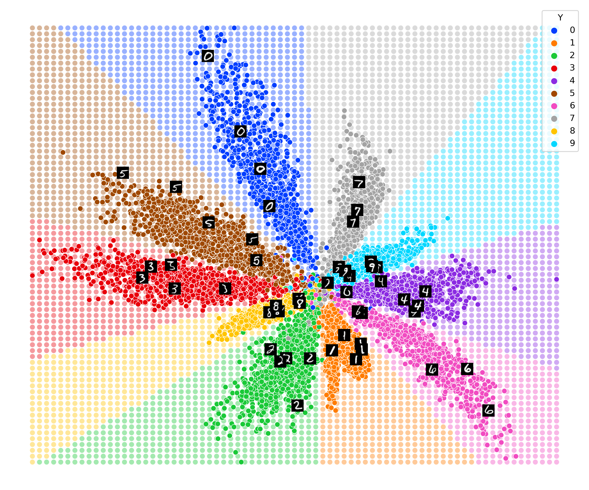

# Convolutional Supervised Autoencoder - CSAE
The Keras implementation on the MNIST Dataset and the Supplementary Material of the Supervised Dimensionality Reduction and Classification with Convolutional Autoencoders.

## Experiment on MNIST Dataset
### Usage
1. Clone the code to local machine
```
git clone https://github.com/JohnNellas/CSAE
```
2. Create the environment from the environment.yml file.
```
conda env create -f environment.yml
```
3. Activate the environment
```
conda activate csae_env
```
4. Run the experiment on MNIST with a *dimensions_latent_space* dimensional latent space
```
python3 main.py dimensions_latent_space
```

### Example

Run the experiment for a CSAE with a 10D Latent Space
```
python3 main.py 10
```
### Folder Creation
The script execution produces a checkpoint folder along with a folder that contains the classification and visualization results, which are entitled as ```checkpoints_classification_ae``` and ```classification_and_visualization_results_CSAE```, correspondingly

### Classification Results and Visualizations

### Classification Results
The Classification methodologies are also evaluated and the results are saved in the ```classification_resuls``` sub folder of the directory ```classification_and_visualization_results_CSAE```.

#### Visualizations
Additionally, the script execution creates a set of visualizations. Initially, a Latent Space visualization is constructed. In more detail, if the constructed Latent Space has a dimensionality equal to two (2) or three (3), then a 2D or 3D scatter plot of the raw embedding is constructed, while for a dimensionality greater than 3, the Latent Space is visualized by creating a 2D scatterplot of the embeddings produced by applying PCA or t-SNE onto the derived Latent Representations. Moreover, concerning the case where the Latent Space of CSAE is 2D, a 2D scatterplot of the raw embeddings along with the Classifier's Decision boundary is constructed, where some points are replaced by the corresponding original images, while for the same case, a figure of the images derived from decoding a latent representation grid is also generated. Finally, a plot of the accuracy, reconstruction and classification error per epoch during the training and validation procedure is constructed. The resulting visualization are saved in the ```visualization_results``` subfolder of the directory ```classification_and_visualization_results_CSAE```. Some examples of the afforemetioned figures, for the two dimensional latent space are presented below.



## Supplementary Material
Finally, the supplementary material is contained in the pdf file with name "supplementary_material.pdf"
