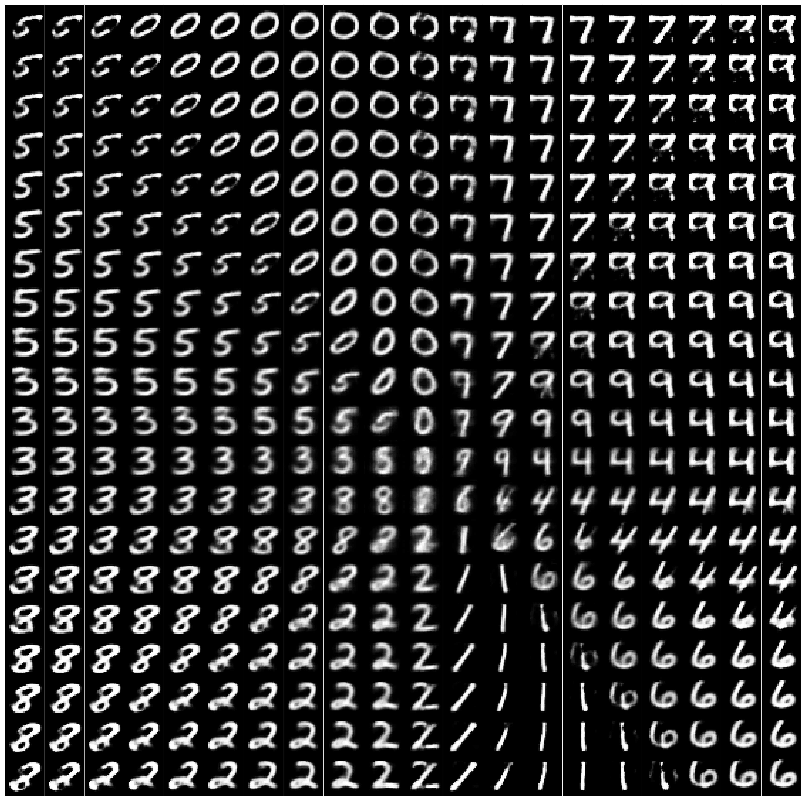

# Convolutional Supervised Autoencoder - CSAE
Keras implementation of the Supervised Dimensionality Reduction and Classification with Convolutional Autoencoders on the MNIST Dataset.

# Usage
1. Clone the code to local machine
```
git clone https://github.com/JohnNellas/CSAE
```
2. Create the environment from the environment.yml file.
```
conda env create -f environment.yml
```
3. Activate the environment
```
conda activate csae_env
```
4. Run the experiment on MNIST with a *dimensions_latent_space* dimensional latent space
```
python3 main.py dimensions_latent_space
```

# Example

Run the experiment for a CSAE with a 10D Latent Space
```
python3 main.py 10
```

# Visualizations
The script execution produces a checkpoint folder and a folder that contains the classification and visualization results. Regarding the latter, for a latent space of dimensions greater or equal to 2 a scatter plot of the latent space is created. For Latent Space of two or three dimensions a two or three dimensional scatter is created respectively, while for a number of dimensions greater than three, the two dimensional scatterplot is created using the PCA and t-SNE methods. The resulting scatter plot, is coloured based on the ground truth of each embedding. Also, specifically for the two dimensional latent space, a figure containing the resulting images of a decoded grid of points of the latent space, is created. Additionally, another figure is constructed, which presents a scatter plot of the latent space constructed by CSAE, the decision boundary of the classifier drawn onto the corresponding latent space, and additionally, some of the embeddings are replaced with the original image that the embedding originated from. Finally, a plot of the accuracy, reconstruction and classification error per epoch during the training and validation procedure is created. Some examples of the afforemetioned figures, for the two dimensional latent space are presented below.


